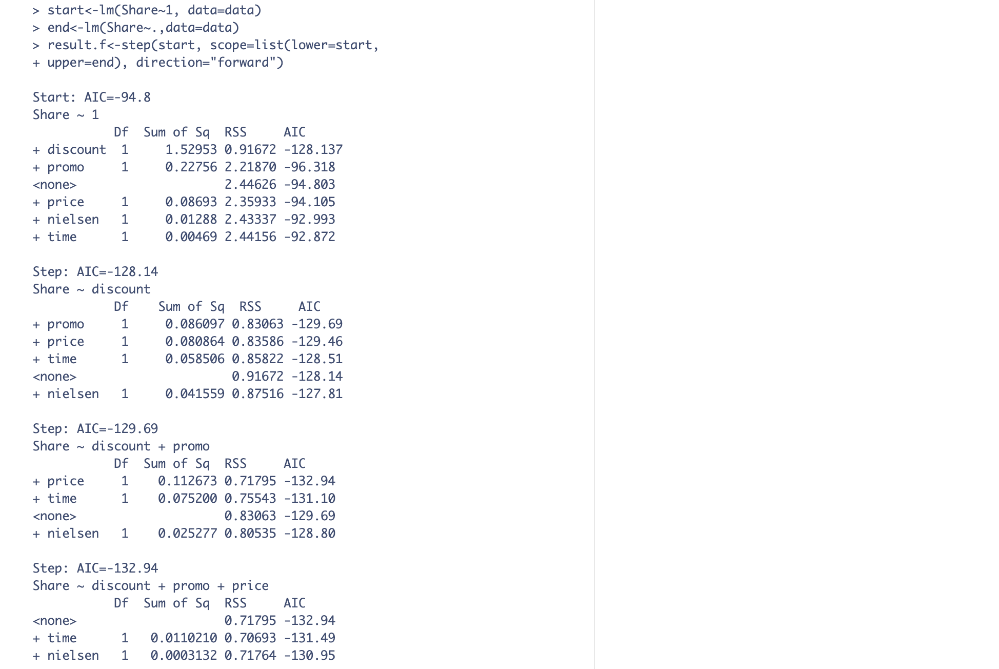
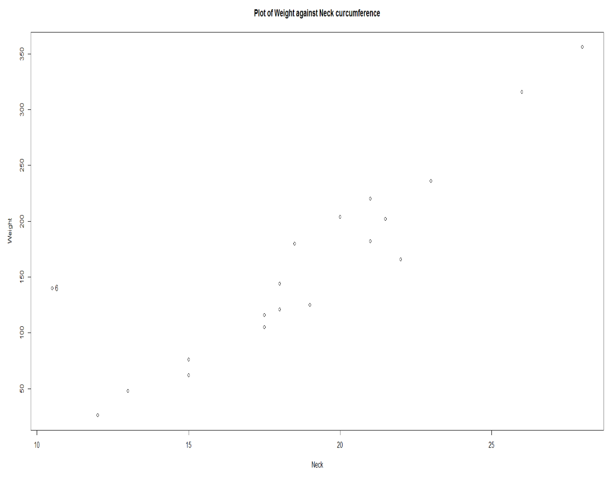

```{r setup, include=FALSE}
knitr::opts_chunk$set(echo = TRUE)
library(tidyverse)
library(ggplot2)
library(GGally)
library(multcomp)
library(leaps)
library(car)
library(ROCR)
```


#### 1. For this question, we will use the “nfl.txt” data set. As a reminder, the data are on NFL team performance from the 1976 season. The variables are:
- `y`: Games won (14-game season)  
- `x1`: Rushing yards (season)  
- `x2`: Passing yards (season)  
- `x3`: Punting average (yards/punt)  
- `x4`: Field goal percentage (FGs made/FGs attempted)  
- `x5`: Turnover differential (turnovers acquired minus turnovers lost)  
- `x6`: Penalty yards (season)  
- `x7`: Percent rushing (rushing plays/total plays)  
- `x8`: Opponents’ rushing yards (season)  
- `x9`: Opponents’ passing yards (season)  

```{r}
nfl <- read.table("nfl.txt", header=TRUE)
head(nfl)
```

(a) **Use the regsubsets() function from the leaps package to run all possible regressions. Set nbest=1. Identify the model (the predictors and the corresponding estimated coefficients) that is best in terms of**
i. Adjusted $R^2$  
ii. Mallow’s $C_p$  
iii. BIC  

```{r}
allreg <- leaps::regsubsets(y ~., data=nfl, nbest=1)
#summary(allreg)
coef(allreg, which.max(summary(allreg)$adjr2))
coef(allreg, which.min(summary(allreg)$cp))
coef(allreg, which.min(summary(allreg)$bic))
```

The regression with the highest adj $R^2$ is:
$$Y = -1.821703427 + 0.003818572(X2) + 0.216894094(X7) + -0.004014887(X8) + -0.001634926(X9)$$  

The regression with the best Mallow's $C_p$ is:
$$Y = -1.808372059 + 0.003598070(X2) + 0.193960210(X7) + -0.004815494(X8)$$  

The regression with the best BIC is:
$$Y = -1.808372059 + 0.003598070(X2) + 0.193960210(X7) + -0.004815494(X8)$$  

We notice that the model selected using Mallow's $C_p$ is the same as the model selected using BIC.

(b) **For the models found in part 1a, use residual plots to assess if the regression assumptions are met, and address if any variables need to be transformed. If needed, transform the appropriate variable, and re-do part 1a using the transformed variables.**

```{r}
adj2_mod <- lm(y~x2+x7+x8+x9, data=nfl)
cp_bic_mod <- lm(y~x2+x7+x8, data=nfl)

par(mfrow = c(2, 2))
plot(adj2_mod)

par(mfrow = c(2, 2))
plot(cp_bic_mod)
```

All of the assumptions appear to be met in both the model chosen using adjusted $R^2$ and the model chosen using Mallow's $C_p$ and BIC. This is clear because the residuals are scattered randomly around 0 in the residual plot with constant variance for both models. No transformations are needed.


(c) **Run forward selection, starting with an intercept-only model. Report the predictors and the estimated coefficients of the model selected.**

```{r}
##intercept only model
regnull <- lm(y~1, data=nfl)
##model with all predictors
regfull <- lm(y~., data=nfl)

##forward selection, backward elimination, and stepwise regression
step(regnull, scope=list(lower=regnull, upper=regfull), direction="forward")
```

The predictors in the model selected by the forward selection are x8, x2, x7, and x9. The estimated regression equation is:
$$Y = -1.821703 + -0.004015(X8) + 0.003819(X2) + 0.216894(X7) + -0.001635(X9)$$

(d) **Run backward elimination, starting with the model with all predictors. Report the predictors and the estimated coefficients of the model selected.**

```{r}
step(regfull, scope=list(lower=regnull, upper=regfull), direction="backward")
```

The predictors in the model selected by the backward elimination are x2, x7, x8, and x9. The estimated regression equation is:
$$Y = -1.821703 + 0.003819(X2) + 0.216894(X7) + -0.004015(X8) + -0.001635(X9)$$

This models chosen by the forward and backward stepwise selection proceedures are the same with the same coefficients!


(e) **The PRESS statistic can be used in model validation as well as a criteria for model selection. Unfortunately, the regsubsets() function from the leaps package does not compute the PRESS statistic. The PRESS statistic can be written as**

$$PRESS = \sum_{i=1}^{n}[y_i - \hat y_{i(i)}]^2 \\ = \sum_{i=1}^{n}({e_i \over 1- h_{ii}})^2$$

**where ** $h_{ii}$ **denotes the ith diagonal element from the hat matrix. Write a function that computes the PRESS statistic for a regression model.**

*Hint: the diagonal elements from the hat matrix can be found using the lm.influence() function.*

A function that can be used to compute the PRESS statistic for a regression model is as follows: 

```{r}
PRESS <- function(model){
  sum((resid(model)/(1 - lm.influence(model)$hat))^2)
}
```


(f) **Using the function you wrote in part 1e, calculate the PRESS statistic for your regression model with x2, x7, x8, x9 as predictors. Calculate the R2 Prediction for this model, and compare this value with its R2. What comments can you make about the likely predictive performance of this model?**

```{r}
newmodel <- lm(y~x2+x7+x8+x9, data=nfl)
anova(newmodel)

#PRESS stat
press_stat = PRESS(newmodel)
press_stat

#R^2 Prediction
SSt= (76.193+139.501+41.400+4.866+65.004)
1-(press_stat/SSt)

#actual R^2
summary(newmodel)$r.squared
```


The press statistic is 87.65965.

$R^2_{prediction} = 0.7318982$  which is less than the true $R^2 = 0.8011882$. This may be  an indication that there is some overfitting in this model. In other words, there may be more predictors than are needed and helpful for prediction purposes.


*For the rest of the parts, we regress the number of games won against four predictors: passing yards, x2, percent rushing, x7, opponents’ rushing yards in the season, x8, and opponents’ passing yards in the season, x9.*

(g) **Create partial regression plots for this model. What are these plots telling us?**

```{r}
car::avPlots(newmodel)
```

Based on the partial regression plots for x2, x7, x8, and x9, we see clear linear patterns, as the points are evenly scattered across the blue lines. So x2, x7, x8, and x9 do not need to be transformed.


(h) **Using externally studentized residuals, do we have any outliers? What teams are these?**

```{r}
ext.student<-rstudent(newmodel) ##ext studentized res

ext.student[abs(ext.student)>3]
sort(abs(ext.student))
```
When using externally studentized residuals, we do not have any outliers.


(i) **Do we have any high leverage data points for this multiple linear regression? What teams are these?**

```{r}
hii<-lm.influence(newmodel)$hat ##leverages
n<-nrow(nfl)
p<-5

hii[hii>2*p/n]
sort(hii)
```
We do have one high leverage data point for this multiple linear regression. The team with the high leverage point is the 18th team in the nfl dataset. 


(j) **Use DF F IT Si, DF BET ASj,i, and Cook’s distance to check for influential observations. What teams are influential?**

*First, we identify influential observations based on DFBETAS.*

```{r}
DFBETAS<-dfbetas(newmodel)
abs(DFBETAS)>2/sqrt(n)
```

We see that:
• 1 is influential for $\beta_{X8}$ and $\beta_{X9}$.  
• 4 is influential for $\beta_{X2}$.  
• 10 is influential for $\beta_{X8}$.  
• 15 is influential for $\beta_{X9}$.  
• 21 is influential for $\beta_{0}$(intercept), $\beta_{X7}$, and $\beta_{X8}$.   

```{r}
##see actual values for DFBETAS of these teams
DFBETAS[1,]
DFBETAS[4,]
DFBETAS[10,]
DFBETAS[15,]
DFBETAS[21,]
```
None of the magnitudes in the change of standard errors are larger than 0.54, so the removal of any of these teams does not change the model very significantly. 


*Next, we identify influential observations based on DFFITS:*

```{r}
DFFITS<-dffits(newmodel)
DFFITS[abs(DFFITS)>2*sqrt(p/n)]
sort(abs(DFFITS))
```
None of the teams are flagged as influential using DFFITS because all of their DFFITS are smaller than $2\sqrt{p \over n}$.

*Lastly, let's look at Cook's distance:*

```{r}
COOKS<-cooks.distance(newmodel)
COOKS[COOKS>1]
sort(COOKS)
```
None of the observations are flagged as influential for having a Cook's Distance value greater than 1.  

Since both DFFITS and Cook's Distance do not flag any teams as being influential, none of the teams are influential enough to require removal in my opinion even though DFBETAS flagged teams 1, 4, 10, 15, and 21. 

----

#### 2. The Western Collaborative Group Study (WCGS) is one of the earliest studies regarding heart disease. Data were collected from 3154 males aged 39 to 59 in the San Francisco area in 1960. They all did not have coronary heart disease at the beginning of the study. The data set comes from the faraway package and is called wcgs. We will focus on predicting the likelihood of developing coronary heart disease based on the following predictors:
- `age`: age in years  
- `sdp`: systolic blood pressure in mm Hg  
- `dbp`: diastolic blood pressure in mm Hg  
- `cigs`: number of cigarettes smoked per day  
- `dibep`: behavior type, labeled A and B for aggressive and passive respectively.  

#### The response variable is chd, whether the person developed coronary heart disease during annual follow ups in the study. Read the data in. We will also randomly split the data into two: half the data will be the training data set, and the remaining half will be the test data set. We will explore the training-test split in more detail in the next module. For this exercise, perform all analysis on the training data. The code below will randomly split the data into two halves.


```{r}
library(faraway)
Data<-faraway::wcgs
set.seed(6021) ##for reproducibility to get the same split
sample<-sample.int(nrow(Data), floor(.50*nrow(Data)), replace = F)
train<-Data[sample, ] ##training data frame
test<-Data[-sample, ] ##test data frame
```


(a) **Before fitting a model, create some data visualizations to explore the relationship between these predictors and whether a middle-aged male develops coronary heart disease.**

```{r}
chart1<-ggplot2::ggplot(train, aes(x=dibep, fill=chd))+
  geom_bar(position = "fill")+
  labs(x="Behavior type, labeled A and B for aggressive and passive respectively", y="Proportion",
       title="Proportion of Coronary Heart Disease Status by Behavior Type")
chart1


dp1<-ggplot2::ggplot(train,aes(x=age, color=chd))+
  geom_density()+
  labs(title="Density Plot of Age",
       subtitle= "by Coronary Heart Disease Status")

dp2<-ggplot2::ggplot(train,aes(x=sdp, color=chd))+
  geom_density()+
  labs(title="Density Plot of Systolic Blood Pressure (mm Hg)",
       subtitle= "by Coronary Heart Disease Status")

dp3<-ggplot2::ggplot(train,aes(x=dbp, color=chd))+
  geom_density()+
  labs(title="Density Plot of Diastolic Blood Pressure (mm Hg)",
       subtitle= "by Coronary Heart Disease Status")

dp4<-ggplot2::ggplot(train,aes(x=cigs, color=chd))+
  geom_density()+
  labs(title="Density Plot of Cigarettes Smoked per Day",
       subtitle= "by Coronary Heart Disease Status")

gridExtra::grid.arrange(dp1, dp2, dp3, dp4, ncol = 2, nrow = 2)
```

- Looking at the bar graph, we see that the proportion of people with coronary heart disease is nearly double in men with aggressive (A) behavior type than those with passive (B) behavior type.  
- When looking at age, we see that those older than 47 have higher levels of coronary heart disease than those younger than 47.   
- The higher the systolic blood pressure, the higher the levels of coronary heart disease based on the top left plot.  
- Diastolic blood pressure seems to have a smaller impact on coronary heart disease because there is not a large difference between the density lines. There may be higher levels of coronary heart disease when the dbp is between 90 and 110 mm Hg.  
- Finally there are higher levels of coronary heart disease for those who smoke more cigarettes per day.  

Overall, we see that behavior type, smoking, and age seem to play the biggest role in whether a person develops heart disease.

(b) **Use R to fit the logistic regression model using all the predictors listed above, and write the estimated logistic regression equation.**

```{r}
chdfull <- glm(chd~age+sdp+dbp+cigs+dibep, family="binomial", data=train)
chdfull
```

The estimated regression equation is: $chd = -8.30877 + 0.06021(age) + 0.01512(sdp) + 0.01203(dbp) + 0.02137(cigs) + -0.52691(dibepB)$


(c) **Interpret the estimated coefficient for cigs in context.**

```{r}
exp(0.02137)
```

The estimated odds of a middle-aged male developing coronary heart disease is multiplied by a factor of exp(0.02137) = 1.0216 for each additional cigarette smoked per day, when controlling for age, systolic blood pressure, diastolic blood pressure, and behavior type.


(d) **Interpret the estimated coefficient for dibep in context.**

```{r}
exp(-0.52691)
```

The estimated odds of a middle-aged male developing coronary heart disease is exp(-0.52691) = 0.5904266 times the odds for people with behavior type A (aggressive), when controlling for age, systolic blood pressure, diastolic blood pressure, and cigarettes smoked per day.


(e) **What are the estimated odds of developing heart disease for an adult male who is 45 years old, has a systolic blood pressure of 110 mm Hg, diastolic blood pressure of 70 mm Hg, does not smoke, and has type B personality? What is this person’s corresponding probability of developing heart disease?**

```{r}
newdata1<-data.frame(age=45, sdp=110, dbp=70,cigs=0,dibep="B")

##predicted log odds for test data
logodds<-predict(chdfull, newdata=newdata1)
logodds
exp(logodds)

##predicted probabilities for test data
probs<-predict(chdfull, newdata=newdata1, type="response")
probs
```

The estimated odds of developing heart disease for an adult male who is 45 years old, has a systolic blood pressure of 110 mm Hg, diastolic blood pressure of 70 mm Hg, does not smoke, and has type B personality is exp(-3.621211) = 0.02675027.  

This persons corresponding predicted probability of developing heart disease is 0.02605333


(f) **Carry out the relevant hypothesis test to check if this logistic regression model with five predictors is useful in estimating the odds of heart disease. Clearly state the null and alternative hypotheses, test statistic, and conclusion in context.**

$H_0 : \beta_{age} = \beta_{sdp} = \beta_{dbp} = \beta_{cigs} = \beta_{dibepB} = 0$ (The full model is not useful for estimating the odds of heart disease)  
$H_A :$ At least one coefficient in $H_0$ is nonzero (The full model is useful for estimating the odds of heart disease)   

```{r}
#likelihood ratio test
chdnull <- glm(chd~1, family="binomial", data=train)

##test statistic
TS1<-chdnull$deviance-chdfull$deviance
TS1

##critical value
qchisq(1-0.05,5)

##pvalue
1-pchisq(TS1,5)
```

Test Statistic, $\triangle G^2$, = 55.49501  
Critical value = 11.0705  
P-value = $1.032455*10^{-10}$  

Because the test statistic is larger than the critical value, and the p-value is smaller than $\alpha=0.05$, we reject $H_0$ in favor of $H_A$. In other words, we have enough evidence to conclude that this logistic regression model with five predictors is useful in estimating the odds of heart disease compared to the intercept-only model.


(g) **Suppose a co-worker of yours suggests fitting a logistic regression model without the two blood pressure variables. Carry out the relevant hypothesis test to check if this model without the blood pressure variables should be chosen over the previous model with all five predictors.**

$H_0 : \beta_{sdp} = \beta_{dbp} = 0$ (We can drop the two blood pressure variables in the presence of the other predictors)  
$H_A :$ At least one coefficient in $H_0$ is nonzero (We cannot drop the two blood pressure variables in the presence of the other predictors)   

```{r}
#likelihood ratio test
chdred <- glm(chd~age+cigs+dibep, family="binomial", data=train)

##test statistic
TS2<-chdred$deviance-chdfull$deviance
TS2

##critical value
qchisq(1-0.05,2)

##pvalue
1-pchisq(TS2,2)
```

Test Statistic, $\triangle G^2$, = 13.70587  
Critical value = 5.991465  
P-value = $0.00105635$  

Because the test statistic is larger than the critical value, and the p-value is smaller than $\alpha=0.05$, we reject $H_0$ in favor of $H_A$. In other words, we have enough evidence to conclude that `sdp` and `dbp` are necessary to keep in the model in the presence of the other variables. We cannot drop both `sdp` and `dbp` as they are necessary in this model, so the logistic regression model with five predictors is preferred. 


(h) **Based on the Wald test, is diastolic blood pressure a significant predictor of heart disease, when the other predictors are already in the model?**

$H_0 : \beta_{dbp} = 0$ (We can drop diastolic blood pressure variables in the presence of the other predictors, it is not a significant predictor)  
$H_A : \beta_{dbp} \neq 0$ (We cannot drop diastolic blood pressure variables in the presence of the other predictors, it is a significant predictor)   

```{r}
summary(chdfull)

Z = 0.012026-0/0.014345
Z
```

Test Statistic Z = 0.838  
P-value = 0.401818

Because the p-value is greater than $\alpha=0.05$, we fail to reject $H_0$. We do not have enough evidence to support keeping `dbp` in the model in the presence of the other predictors, so we can drop `dbp` from the logistic regression model.


(i) **Based on all the analysis performed, which of these predictors would you use in your logistic regression model?**

We found in part 2g that we cannot remove both `sdp` and `dbp` from the model as they are significant predictors in the presence of the other variables. Then, in part 2h, we note that we should drop `dbp` because it alone is not a significant predictor in the presence of the other variables in the model. Using this information along with the visuals created in 2a, I think we should use only `age`, `sdp`, `cigs`, and `dibep` as predictors of coronary heart disease in middle-aged males.


(j) **Fit a logistic regression model based on your answer in part 2i. Based on the estimated coefficients of your logistic regression, briefly comment on the relationship between the predictors and the (log) odds of developing heart disease.**

```{r}
chdnew <- glm(chd~age+sdp+cigs+dibep, family="binomial", data=train)
summary(chdnew)
```

The estimated regression equation is: $chd = -8.065578 + 0.060880(age) + 0.020757(sdp) + 0.020642(cigs) + -0.531792(dibepB)$

$\beta_{age} = 0.060880$. The estimated log odds a middle-aged male developing coronary heart disease increases by 0.060880 for each additional year of age, when controlling for the other predictors.  
$\beta_{sdp} = 0.020757$. The estimated log odds a middle-aged male developing coronary heart disease increases by 0.020757 for each additional unit of systolic blood pressure in mm Hg, when controlling for the other predictors.  
$\beta_{cigs} = 0.020642$. The estimated log odds a middle-aged male developing coronary heart disease increases by 0.020642 for each additional cigarette smoked per day, when controlling for the other predictors.  
$\beta_{dibepB} = -0.531792$. The estimated log odds a middle-aged male developing coronary heart disease is 0.531792 lower for people with passive (B) behavior type than aggressive (A) behavior type, when controlling for the other predictors.  


(k) **Validate your logistic regression model using an ROC curve. What does your ROC curve tell you?**

```{r}
##predicted probs for test data
preds<-predict(chdnew,newdata=test, type="response")

##produce the numbers associated with classification table
rates<-ROCR::prediction(preds, test$chd)

##store the true positive and false positive rates
roc_result<-ROCR::performance(rates,measure="tpr", x.measure="fpr")

plot(roc_result, main="ROC Curve for Reduced Model")
lines(x = c(0,1), y = c(0,1), col="red") 
```

Because our ROC curve is above the diagonal line, we see that the logistic regression does better than randomly guessing. 

(l) **Find the AUC associated with your ROC curve. What does your AUC tell you?**

```{r}
auc<-ROCR::performance(rates, measure = "auc")
auc@y.values
```

The AUC of our ROC curve is 0.7371679, which means our logistic regression does better than random guessing, but does not classify all observations correctly.


(m) **Create a confusion matrix using a cutoff of 0.5. Report the accuracy, true positive rate (TPR), and false positive rate (FPR) at this cutoff.**

```{r}
##confusion matrix with threshold of 0.5
table(test$chd, preds>0.5)
```
Accuracy = $1449 \over 1577$ = 0.9188332  
True Positive Rate = $0 \over 128$ = 0  
False Positive Rate = $0 \over 1449$ = 0   


(n) **Based on the confusion matrix in part 2m, a classmate says the logistic regression at this cutoff is as good as a “no information classifier”. Do you agree with your classmate’s statement? Briefly explain.**

Yes, I do agree with this classmate. At threshold 0.5, this model is "guessing at random" or is a “no information classifier” because no matter what the data shows, the outcome is always reported as false, or not developing coronary heart disease.  


(o) **Discuss if the threshold should be adjusted. Will it be better to raise or lower the threshold? Briefly explain.**

I do think that the threshold should be adjusted. It would be best to lower the threshold to correctly identify observations of people who have coronary heart disease to increase the true positive rate. The impact of misclassifying all these points is that these people would not be treated for heart disease when they need to be. We would be willing to accept the consequence of increasing the false positive rate because if someone without heart disease was told they do have it, that would not be as devastating.

The best way to determine what value to change the threshold to would be by consulting with an expert in the field.

(p) **Based on your answer in part 2o, adjust the threshold accordingly, and create the corresponding confusion matrix. Report the accuracy, TPR, and FPR for this threshold.**

```{r}
##confusion matrix with threshold of 0.1
table(test$chd, preds>0.1)

#0.1
fpr0.1=335/1449
tpr0.1=71/128
accuracy= (1114+71)/1577
accuracy

plot(roc_result, main="ROC Curve for Reduced Model, Threshold: 0.1")
lines(x = c(0,1), y = c(0,1), col="red") 
points(x=fpr0.1, y=tpr0.1, col="blue", pch=16)
```

After exploring the impact of various different threshold values on the accuracy, true positive rate, and false positive rate for classifying coronary heart disease, I decided that a threshold value of 0.1 would be best.

With threshold = 0.1:  
Accuracy = $1114+71 \over 1577$ = 0.7514268  
True Positive Rate = $71 \over 128$ = 0.5546875  
False Positive Rate = $57 \over 128$ = 0.4453125


(q) **Comment on the results from the confusions matrices in parts 2m and 2p. What do you think is happening?**

There are so many more negative observations in the data than positive, the model was being inflated toward negatives. In other words, we are modeling a rare event using an unbalanced sample with very unequal proportions between those with and without coronary heart disease. Therefore, at the usual 0.5 threshold, more predictions were classified as negative because there were so few examples of positive in the training and testing data sets.


----

#### 3. For this question, we will revisit the penguins data set from the palmerpenguins package. The data set contains information regarding measurements of adult penguins near Palmer station, Antarctica. We will focus on using the four measurement variables (bill length, bill depth, flipper length, body mass) to model the gender of the penguins. Since there are three species involved, we also want to control for species in the logistic regression. We will not consider the island and year in this logistic regression. 

*When you read the data in, notice that there are a number of penguins with missing values for gender. Remove these observations from the data frame. Also remove columns 2 and 8 since we are not considering island and year in this logistic regression.*

*You can run the following block of code to carry out the needed steps.*

```{r}
library(palmerpenguins)
Data<-palmerpenguins::penguins
##remove penguins with gender missing
Data<-Data[complete.cases(Data[ , 7]),-c(2,8)]
##80-20 split
set.seed(1)
sample<-sample.int(nrow(Data), floor(.80*nrow(Data)), replace = F)
train<-Data[sample, ]
test<-Data[-sample, ]
head(train)
```


(a) **Create some data visualizations to explore the relationship between the various body measurements and the gender of penguins. Be sure to briefly comment on your data visualizations.**

```{r}
chart2<-ggplot2::ggplot(train, aes(x=species, fill=sex))+
  geom_bar(position = "fill")+
  labs(x="Species", y="Sex",
       title="Proportion of Penguin Sex by Species")
chart2


dp1<-ggplot2::ggplot(train,aes(x=bill_length_mm, color=sex))+
  geom_density()+
  labs(title="Density Plot of Bill Length (mm)",
       subtitle= "by Penguin Sex")

dp2<-ggplot2::ggplot(train,aes(x=bill_depth_mm, color=sex))+
  geom_density()+
  labs(title="Density Plot of Bill Depth (mm)",
       subtitle= "by Penguin Sex")

dp3<-ggplot2::ggplot(train,aes(x=flipper_length_mm, color=sex))+
  geom_density()+
  labs(title="Density Plot of Flipper Length (mm)",
       subtitle= "by Penguin Sex")

dp4<-ggplot2::ggplot(train,aes(x=body_mass_g, color=sex))+
  geom_density()+
  labs(title="Density Plot of Body Mass (g)",
       subtitle= "by Penguin Sex")

gridExtra::grid.arrange(dp1, dp2, dp3, dp4, ncol = 2, nrow = 2)
```

There is roughly an equal proportion of male and female penguins for each species int this data set. Female penguins on average have smaller body mass and shorter bill length, bill depth, and flipper length than male penguins. Each of these quantitative predictors may be related to penguin sex. It looks like shorter bill length, shorter bill depth, shorter flipper length, and smaller body mass is associated with increased likelihood of being female.

(b) **Use R to fit the logistic regression model. Based on the results of the Wald tests for the individual coefficients, which predictor(s) appears to be insignificant in the model?**

```{r}
sexmod <- glm(sex~bill_length_mm+bill_depth_mm+flipper_length_mm+body_mass_g+species, family="binomial", data=train)
summary(sexmod)
```


Looking at the p-values for each individual coefficient, we notice that flipper length has a p-value larger than $\alpha = 0.05$, which means that is is not a significant predictor in this model according to Walds test. All the other variables are significant. Because of this outcome, we can drop `flipper_length_mm` from our model in the presence of the other variables.


(c) **Based on your answer in part 3b, drop the predictor(s) and refit the logistic regression. Write out the estimated logistic regression equation. If you did not drop any predictor, write out the logistic regression equation from part 3b.**

```{r}
sexmod2 <- glm(sex~bill_length_mm+bill_depth_mm+body_mass_g+species, family="binomial", data=train)
sexmod2
```

After dropping the `flipper_length_mm` predictor, the estimated logistic regression equation is: 
$$sex = -103.2 + 0.9513(bill\_length\_mm) + 2.099(bill\_depth\_mm) + 0.007714(body\_mass\_g) + -10.42(speciesChinstrap) + -12.38(speciesGentoo)$$

(d) **Based on your estimated logistic regression equation in part 3c, how would you generalize the relationship between some of the body measurement predictors and the (log) odds of a penguin being male?**

```{r}
contrasts(train$sex)
```

The estimated log odds of a penguin being male increases by 0.9513 for each additional millimeter of bill length, when controlling for the other variables.  
The estimated log odds of a penguin being male increases by 2.099 for each additional millimeter of bill depth, when controlling for the other variables.  
The estimated log odds of a penguin being male increases by 0.007714 for each additional gram of body mass, when controlling for the other variables.  

In general, when controlling for species, the log odds of a penguin being male increases with larger body measurements when taking all variables into account.

(e) **Based on your estimated logistic regression equation in part 3c, interpret the estimated coefficient for bill length contextually.**

```{r}
exp(0.9513)
```

The estimated log odds of a penguin being male increases by 0.9513 for each additional millimeter of bill length, when controlling for the other variables. In other words, the estimated odds of a penguin being male is multiplied by exp(0.9513) = 2.589073 for each additional millimeter of bill length, when controlling for the other variables.     


(f) **Consider a Gentoo penguin with bill length of 49mm, bill depth of 15mm, flipper length of 220mm, and body mass of 5700g. Based on your estimated logistic regression equation in part 3c, what are the log odds, odds, and probability that this penguin is male?**

```{r}
newdata2<-data.frame(bill_length_mm=49, bill_depth_mm=15, flipper_length_mm=220,body_mass_g=5700, species="Gentoo")

##predicted log odds for test data
logodds<-predict(sexmod2, newdata=newdata2)
logodds
exp(logodds)

##predicted probabilities for test data
probs<-predict(sexmod2, newdata=newdata2, type="response")
probs
```
The log odds that a a Gentoo penguin with bill length of 49mm, bill depth of 15mm, flipper length of 220mm, and body mass of 5700g is male is 6.462668. In other words, the estimated odds that this penguin is make is exp(6.462668) = 640.7683. This penguins corresponding predicted probability of being male is 0.9984418.


(g) **Conduct a relevant hypothesis test to assess if the logistic regression in part 3c is a useful model. Be sure to write out the null and alternative hypotheses, report the value of the test statistic, and write a relevant conclusion.**

$H_0 : \beta_{bill\_length\_mm} = \beta_{bill\_depth\_mm} = \beta_{body\_mass\_g} = \beta_{speciesChinstrap} = \beta_{speciesGentoo} = 0$ (The full model is not useful for estimating the sex of a penguin)   
$H_A :$ At least one coefficient in $H_0$ is nonzero (The full model is useful for estimating the sex of a penguin)   

```{r}
#likelihood ratio test
sexnull <- glm(sex~1, family="binomial", data=train)

##test statistic
TS1<-sexnull$deviance-sexmod2$deviance
TS1

##critical value
qchisq(1-0.05,4)

##pvalue
1-pchisq(TS1,4)
```

Test Statistic, $\triangle G^2$, = 298.4472  
Critical value = 9.487729  
P-value = 0

Because the test statistic is larger than the critical value, and the p-value is smaller than $\alpha=0.05$, we reject $H_0$ in favor of $H_A$. In other words, we have enough evidence to conclude that this logistic regression model with the body weight, bill length, bill depth, and species predictors is useful in estimating the sex of a penguin compared to the intercept-only model.


(h) **Validate your model from part 3c on the test data by creating an ROC curve. What does your ROC curve tell you?**

```{r}
##predicted probs for test data
preds<-predict(sexmod2,newdata=test, type="response")

##produce the numbers associated with classification table
rates<-ROCR::prediction(preds, test$sex)

##store the true positive and false positive rates
roc_result<-ROCR::performance(rates,measure="tpr", x.measure="fpr")

table(test$sex, preds>0.5)

fpr0.5=7/35
tpr0.5=28/32
accuracy= (28+28)/67
accuracy

plot(roc_result, main="ROC Curve for Reduced Model")
lines(x = c(0,1), y = c(0,1), col="red") 
points(x=fpr0.5, y=tpr0.5, col="blue", pch=16)
```

This ROC curve is very far above the diagonal, so it does much better than random guessing.

(i) **Find the AUC associated with your ROC curve. What does your AUC tell you?**

```{r}
auc<-ROCR::performance(rates, measure = "auc")
auc@y.values
```

The AUC of our ROC curve is 0.9214286, which means our logistic regression does better than random guessing. Since the AUC is very close to 1, our logistic regression is very close to classifying all observations correctly.


(j) **Create a confusion matrix using a threshold of 0.5. What is the false positive rate? What is the false negative rate? What is error rate?**

```{r}
##confusion matrix with threshold of 0.5
table(test$sex, preds>0.5)
```

FPR = $7 \over 28+7$ = $7 \over 35$ = 0.2  
FNR = $4 \over 28+4$ = $4 \over 32$ = 0.125  
Error Rate=  $7 + 4 \over 28+7+4+28$ = $11 \over 67$ = 0.1641791  
Accuracy = $28+28 \over 28+7+4+28$ = $56 \over 67$ = 0.8358209  

(k) **Discuss if the threshold should be changed. If it should be changed, explain why, and create another confusion matrix with a different threshold.**

I do not think the threshold should be changed. When using a threshold of 0.5, the false negative and false positive rates are both very low. The error rate is very small and there is a fairly high accuracy, so there is nothing major to change. Additionally, there is no advantage to predicting females with more accuracy than males or vise versa so one should not be improved at the expense of the other.


----

#### 4. (You may only use R as a simple calculator or to find p-values or critical values) The data for this question are 36 monthly observations on variables affecting sales of a product. The objective is to determine an efficient model for predicting and explaining market share sales, Share, which is the average monthly market share for the product, in percent. The predictors are average monthly price in dollars, price, amount of advertising exposure based on gross Nielson rating, nielsen, whether a discount price was in effect, discount (1 if discount, 0 otherwise), whether a package promotion was in effect, promo (1 if promotion, 0 otherwise), and time in months, time.


(a) **The output below is obtained after using the step() function using forward selection, starting with a model with just the intercept term. What predictors are selected based on forward selection?**

 
Based on forward selection `discount`, `promo`, and `price` are selected as predictors for predicting `share`. 

(b) **Your client asks you to explain what each step in the output shown above means. Explain the forward selection procedure to your client, for this output.**

When trying to predict `share`, the average monthly market share for the product, this forward selection procedure first creates a linear regression model that does not use any predictors (the null model) to predict `share.` It then evaluates all the variables in the dataset to determine which one would improve the model the most if added as a predictor. The most helpful variable is added into the model and then the process is repeated, adding the variable that most improves the prediction model one-by-one until the addition of predictors no longer helps make the model better. In the output above we see that in the first step, `discount` makes the largest positive impact on the model so it is added. Next, when looking at the model of `share` predicted by `discount` we note that the addition of `promo` would further improve the model so this is done. Next, `price` further improves the model so it is added, but the last two variables we have available in our dataset would make the model worse so we end with the final model of `share` being predicted by `discount`, `promo`, and `price`.


(c) **Your client asks if he should go ahead and use the models selected in part 4a. What advice do you have for your client?**

While the model selected in part 4a is a useful model, it would be a good idea to run other selection methods to determine if the model generated is the best one. A backward selection method, which removes variables one-by-one until the best model is left, would be useful to look into as well as a method which works by both adding and subtracting variables to create the bet model. Additionally, while these selection methods are useful for quickly determining some of the best models with the fewest necessary predictors, you should always perform an analysis on the models to assess if the regression assumptions are met and determine if any transformations are necessary before using it further.


----

#### 5. (You may only use R as a simple calculator or to find p-values or critical values)

#### Data from n = 19 bears of varying ages are used to develop an equation for estimating Weight from Neck circumference. From a visual inspection of the scatterplot, it appears observation 6 may be an outlier.



*The output below comes from fitting the linear regression model on the data.*

    ##with all 19 bears
    Coefficients:
    Estimate Std. Error t value Pr(>|t|)
    (Intercept) -158.78 40.46 -3.924 0.00109 **
    Neck 16.95 2.10 8.071 3.24e-07 ***
    Residual standard error: 40.13 on 17 degrees of freedom
    Multiple R-squared: 0.793, Adjusted R-squared: 0.7809
    F-statistic: 65.14 on 1 and 17 DF, p-value: 3.235e-07
    
*The output below comes from fitting the linear regression model on the data, with the outlier removed.*

    ##with outlier removed, so 18 bears
    Coefficients:
    Estimate Std. Error t value Pr(>|t|)
    (Intercept) -234.60 25.93 -9.049 1.08e-07 ***
    Neck 20.54 1.32 15.562 4.39e-11 ***
    Residual standard error: 22.6 on 16 degrees of freedom
    Multiple R-squared: 0.938, Adjusted R-squared: 0.9342
    F-statistic: 242.2 on 1 and 16 DF, p-value: 4.394e-11
    
*The output below displays the values of the predictor and response for the 6th observation.*

    > data[6,]
    Neck Weight
    6 10.5 140
    
*Some additional information from R, regarding ordinary residuals, ei, and leverages, hii shown below, from the full data.*

    > result$residuals ##ordinary residuals
             1         2         3         4         5         6         7
    -25.276933 -48.066801 22.880666 23.828133 -2.276933 120.829070 -32.803200
             8         9         10        11        12        13        14
    -18.592131 -38.224400 25.249333 -21.803200 -15.119334 40.248397 34.143331
           15         16        17        18         19
    -3.593068 -33.434532 4.985732 -19.434532 -13.539598
    
    > tmp$hat ##leverages
             1          2          3         4           5          6         7
    0.05422642 0.08132161 0.06633278 0.05682064 0.05422642 0.23960510 0.05700079
             8          9         10        11          12         13         14
    0.17788427 0.05278518 0.05282121 0.05700079 0.06633278 0.28626504 0.19604381
            15         16         17        18          19
    0.07314261 0.09141025 0.10178713 0.09141025 0.14358291


(a) **Calculate the externally studentized residual, ti, for observation 6. Will this be considered outlying?**

```{r}
n = 19 
p = 2
ei = 120.829070
hii = 0.23960510
MSresi = (22.6)^2
t_i = ei / sqrt(MSresi*(1-hii))
t_i
```

The externally studentized residual, ti, for observation 6 is 6.131171. Since this value is greater than 3, this observation is flagged as an outlier.


(b) **What is the leverage for observation 6? Based on the criterion that leverages greater than 2p/n are considered outlying in the predictor(s), is this observation high leverage?**

```{r}
hii
2*p/n
```

Observation 6 is high leverage based on the criterion that leverages greater than 2p/n are considered outlying in the predictor(s) because 2p/n = 0.2105263 which is smaller than the hii of 0.23960510.


(c) **Calculate the DFFITS for observation 6.**

```{r}
dffits = t_i*((hii/(1-hii))^(1/2))
dffits
2*sqrt(p/n)
# dffits > 2*sqrt(p/n) is influential
```

The DFFITS for observation 6 is 3.441691. Because the magnitude of this value is greater than $2\sqrt{p \over n}$ (0.6488857), observation 6 is definitely flagged as a n influential observation. 


(d) **Calculate Cook’s distance for observation 6.**

```{r}
MSres = 40.13^2
r_i = ei / sqrt(MSres*(1-hii))
cooks_d = (r_i^2 / p)*(hii/(1-hii))
cooks_d
```

Any observation with a Cook's Distance value larger than 1 is flagged as influential. Observation 6 has a Cook's Distance of 1.878418 which exceeds that criteria so it is definitely influential.

(e) **Would you say that observation 6 is influential, based on DFFITS and Cook’sdistance?**

Yes, I would say that observation 6 is influential, based on DFFITS and Cook’s distance. This is because the DFFITS for observation 6 is greater than $2\sqrt{p \over n}$ (0.6488857) and the Cook's distance value is larger than 1. This indicates that observation 6 should be flagged as an influential point.

(f) **Briefly describe the difference in what DFFITS and Cook’s distance are measuring.**

DFFITS can be interpreted as the number of standard errors $\hat y$ changes if observation 6 is removed when estimating the model. The numerator of Cook’s distance measures the Squared Euclidean distance between the vector of fitted values with all observations, $\hat y$, and the vector of fitted values with observation 6 removed, $\hat y_6$. So it measures how the fitted values for all observations change, if observation 6 is removed. This is unlike DFFITS, which only measures the change in fitted value for observation 6.

